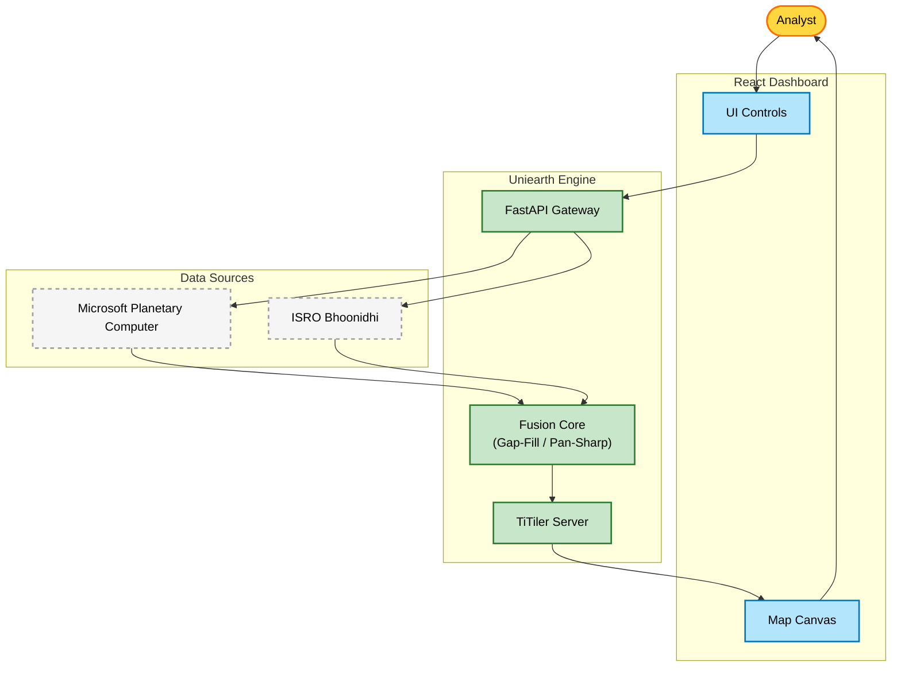

# Uniearth: Multi-Satellite Data Fusion Platform


**Uniearth**  is a next-generation geospatial analysis platform designed to fuse multi-source satellite data into a unified, cloud-free, and analysis-ready stream. It solves the critical problem of data fragmentation by integrating optical data from **Sentinel-2 (ESA)**, **Landsat-8/9 (NASA)**, and **Resourcesat-2 (ISRO)** into a single, cohesive dashboard.

---

## 🏗️ System Architecture

The platform follows a modern microservices architecture, separating data ingestion, processing, and visualization.



---

## 🚀 Key Features

-   **Multi-Constellation Support**: Seamlessly query Sentinel-2, Landsat, and ISRO catalogues.
-   **Intelligent Data Fusion**:
    -   **Cloud Gap Filling**: Automatically replaces cloudy pixels in Sentinel-2 imagery with valid pixels from Landsat timestamps.
    -   **Pan-Sharpening**: Enhances resolution by merging 10m bands with Multispectral data.
-   **Live Analysis Dashboard**:
    -   Interactive map with time-slider controls.
    -   On-the-fly spectral index calculation (NDVI, NDWI).
-   **Security**: Integrated authentication for ISRO Bhoonidhi secure access.

---

## 🛠️ Technology Stack

| Component | Technology | Description |
| :--- | :--- | :--- |
| **Frontend** | React 18, Vite | High-performance UI framework. |
| **Mapping** | OpenLayers | Advanced map rendering engine with EPSG reprojection support. |
| **Backend** | FastAPI (Python) | High-speed async web framework. |
| **Geospatial** | Rasterio, TiTiler | Core libraries for reading and tiling COG (Cloud Optimized GeoTIFF) data. |
| **Data** | STAC API | SpatioTemporal Asset Catalog standard for querying satellite assets. |

---

## ⚙️ Installation & Setup

### Prerequisites
-   Node.js v18+
-   Python 3.11+
-   Git

### 1. Clone the Repository
```bash
git clone https://github.com/your-org/uniearth.git
cd uniearth
```

### 2. Backend Setup
```bash
cd backend
# Create Virtual Environment
python -m venv venv
.\venv\Scripts\activate  # Windows

# Install Dependencies
pip install -r requirements.txt

# Start Server
python -m uvicorn main:app --reload
```
*Server will start at `http://localhost:8000`*

### 3. Frontend Setup
```bash
cd uniearth
# Install Node Modules
npm install

# Start Development Server
npm run dev
```
*Dashboard will launch at `http://localhost:5173`*

---

## 📡 API Reference

The backend exposes a Swagger UI at `http://localhost:8000/docs`.

### Core Endpoints

-   `POST /search`: Query for satellite scenes based on BBox and Date.
-   `POST /fusion/gap-fill`: Trigger cloud removal algorithm on a specific scene.
-   `GET /health`: Check system status.

---


**Team CYBER SOULZ** © 2026. Built for the Future of Earth Observation.
